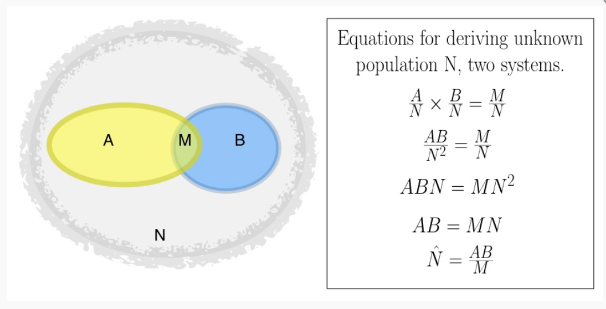

```{r setup, include=F}
knitr::opts_chunk$set(echo=F, message=F, warning=F)

require(tidyverse)
require(janitor)
require(rgdal)
require(sp)
require(sf)
require(raster)
require(Rcapture)
require(dga)
require(rgeos)
require(MASS)
library(bookdown) #for fig captions
library(kableExtra)

knitr::opts_chunk$set(fig.width = 10, fig.height = 4)
knitr::opts_chunk$set(echo=FALSE)
knitr::opts_chunk$set(fig.pos='H')

```


# Estimates of Killing in Casanare

Casanare is a large, rural state in Colombia that includes 19 municipalities and a population of almost 300,000 inhabitants. Located in the foothills of the Andes, Casanare has a history of violence. Casanare (alongside other states, including Arauca) became pivotal to the Colombian government in the 1980s and 1990s when oil reserves were discovered there. Because of this natural resource, the government targeted opposition to what was perceived as the Colombian interest and modernization and the Union Patriotica (UP) in Casanare (as well as Arauca), who supported people’s access to land and workers’ rights, became the victim. Multiple armed groups operated in Casanare, including the Colombian military, paramilitaries, and guerillas, going after “members” (both actual members and merely perceived supporters) of the UP. As a result, many Casanare citizens suffered violent deaths and disappearances. It can be argued that what was seen in Casanare (among other places) in Colombia was “political” genocide (Gomez-Suarez, 2007). But, one of the contentions against framing this episode in Colombian history as a genocide is the low death and disappearances toll.

So how many people have been killed or disappeared? We review the Human Rights Data Nalaysis Group (HRDAG)’s reporting on this issue of population estimation (Guzman et al., 2007).  In this study, the authors used information about victims of killings and disappearances provided by 15 datasets .Any accounting of lethal violence will be incorrect if we assume that any one dataset or combination of datasets contains a comprehensive count of violent acts and disappearances. Registries of violent acts kept by governmental and non-governmental institutions contain some, but not all, of the records of lethal violence. Organizations collecting this data may only have access to certain subsets of a population or geographic areas. 

The datasets come from state agencies – including government, security, forensic and judicial bodies – and from civil society organizations. Across these 15 datasets, there are individuals that have been "captured" only by one dataset, and some that have been captured by multiple. How can we disambguiate the patterns of violence?

\newpage  
# Multiple Systems Estimation (MSE), Capture Re-Capture 

The goal is to estimate the overall population of victims by first estimating the victims who are not captured by any of the datasets.  MSE estimates the total number of disappearances by comparing the size of the overlap(s) between lists to the sizes of the lists themselves. If the overlap is small, this implies that the population from which the lists were drawn is much larger than the lists. If, on the other hand, most of the cases on the lists overlap, this implies that the overall population is not much larger than the number of cases listed.


```{r img.MSE, fig.height=3, fig.cap="Multiple System Estimation"}
library(png)
library(grid)
img <- readPNG("mse_review.png")
 grid.raster(img)
# need to cite this
```


## MSE Assumptions 

There are several MSE assumptions that are need for when there are two "systems" (lists), but not more than that. The assumptions are: 

1. *Closed system*: The population of interest does not change during the measurement period.  This means that the object of measurement, whether that is a population of persons in a country or a population of violent events that occurred in a state, is a closed system: the target population does not change during the period of measurement. This assumption is generally unproblematic for data on violent events, because events that occurred cannot “un-occur” later.

2. *Perfect matching (record linkage!)*: The overlap between systems (i.e., the group of cases recorded in more than one list) is perfectly identified.

3. *Equal probability of capture*: For every data system, each individual has an equal probability of being captured. For example, every death has probability X of being recorded in list 1, every death has probability Y of being recorded in list 2, and so on. TThis assumption, the homogeneity of capture probability, is unlikely to hold for any type of violence data. For example, persons with fewer social connections may be both more likely to go missing and less likely to be reportedmissing; rural locations are more difficult to access than urban ones. Constructing two-sample estimates without accounting for different probabilities of capture leads to conclusions that may be biased.

4. *Independence of lists*: Capture in one list does not affect probability of capture in another list. For example, being reported to one NGO does not change the probability that an individual is reported to another. The third assumption, independence of systems, is similarly difficult to meet.

Like differences in capture probability, dependences between systems are impossible to account for in the the two-system setting. A common example here is the difference between governmental and non-governmental organizations. Because different populations may have different levels of trust in the two organizations, reporting to one type of organization may imply that the witness is very unlikely to report to the other. 

# Overview of Data 

```{r data-sources}
casanare<- read_delim('summary-table.csv', delim= "|")

casanare_capture_recapture <- casanare %>%
  dplyr::select(-c(vln, muni, year)) #just want a matrix of 0s and 1s 

cols_lists <- casanare_capture_recapture %>% dplyr::select(starts_with("d_"))
  
#this function returns any instance of a "capture" for each org
return_1 <-function(x) {
  casanare_capture_recapture %>%
   filter(x ==1) %>% 
  summarize(n=sum(Freq)) %>% dplyr::select(n)

}

#unlist(map(cols_lists, return_1))

unique_records<- casanare_capture_recapture %>%
  mutate(sum_cols = reduce(dplyr::select(., starts_with("d_")), `+`)) %>% 
  filter(sum_cols == 1)  

unique_records<-unique_records %>%
  group_by(d_CCJ, d_EQU, d_FON, d_IMLD ,d_PN0 ,d_CIN, d_FAM ,
           d_FSR, d_IMLM,  d_VP, d_CCE, d_CTI, d_FDC, d_GAU , d_PL) %>%
  summarise(n = sum(Freq))


# print table with each data source and total records "captured"
org_names <- c("Colombian Commision of Jurists", "Equitas", "Fondelibertad", "National Institute of Forensic Medicine Disappearances", "Policía Nacional ", "CINEP ", "Families of Victims’ Organizations","Prosecutor General of Santa Rosa", "Instituto Nacional de Medicina Legal ", "Vice Presidency Office", "Colombia-Europe", "Technical Investigative Body of the Prosecutor Generals Office", "Prosecutor General list of the Disappeared", "Gaula","Pais Libre" ) 


contigency_table<-data.frame(org = org_names,
           total_captures= unlist(map(cols_lists, return_1)),
           only_captured_in_this = c(48,0, 67,9,221,91,1,0,1219,284,30,0,376,1,0),
           type = c("judicial", "civil", "security", "forensic", "security",
                    "civil","civil", "security","forensic", "judicial", "civil", "judicial",
                    "forensic", "security", "civil")) #just hard coded whoops

colnames(contigency_table) <- c("Organization", "Total Captures", "Unique", "Type")

knitr::kable(contigency_table, format="latex", booktabs=T, caption="Contingency Table") %>% 
  kableExtra::kable_styling(latex_options="scale_down") %>%
  kableExtra::kable_styling(latex_options = "HOLD_position")

```

## Overall Trends  

The following graph shows that violence has been concentrated in $\textcolor{red}{\text{municipality}}$.  We can see that the *reported* violence (i.e. the counts in the 15 datasets) appears to have intensified across all municipalities in Casanare in 2003-2004 and then dropped.

```{r mapping-whole-country}
#group deaths by municipality
muni <- casanare %>% mutate(name_2= str_to_title(muni)) %>%group_by(name_2)  %>% summarise(count = sum(Freq))

colombia_dat <- getData('GADM', country='COL', level = 2) %>% 
  st_as_sf() %>% 
  clean_names()

casanare_dat <-  colombia_dat %>% 
  filter(name_1 == "Casanare") %>%  
  mutate(name_2 =  stringi::stri_trans_general(name_2, "Latin-ASCII"))%>% #removes accents for joining purposes
  mutate(name_2 = str_to_title(name_2)) %>%
  left_join( muni, by =c('name_2')) 
 
casanare_overall_plot <- ggplot(casanare_dat, aes(fill = count)) +scale_fill_gradient(low='white', high= 'red')+ 
  geom_sf() +
  theme_void() + 
  ggtitle('Total Counts in 15 Datasets by Municipality 1998-2007')
    
```

```{r mapping-by-muni}
#partition by years
#group deaths by municipality
muni_by_year<- casanare %>% mutate(name_2 = str_to_title(muni)) %>%
  group_by(name_2, year)  %>% 
  summarise(count = sum(Freq))

casanare_dat_with_years <-  colombia_dat %>% 
  filter(name_1 == "Casanare") %>%  
  mutate(name_2 =  stringi::stri_trans_general(name_2, "Latin-ASCII"))%>%
  mutate(name_2 = str_to_title(name_2)) %>%
  left_join( muni_by_year, by =c('name_2')) 


 
casanare_by_years <- ggplot(casanare_dat_with_years, aes(fill = count)) +scale_fill_gradient(low='white', high= 'red')+ 
  geom_sf() +
  theme_void() + facet_wrap( ~ year)+
  ggtitle('Yearly Counts in 15 Datasets by Municipality 1998-2007')
```

```{r gisplots, fig.cap="Overall Trends in 15 Datasets by Municipality"}
gridExtra::grid.arrange(casanare_overall_plot, casanare_by_years, nrow=1)
```


Looking just at the totals of the 15 datasets, that data suggest the violence peaked in 2003-2004 and the total number of victims is 3501.  However, just looking at the trends amoung the totals of the 15 datasets does not give the whole picture.  

## Heterogenity Issues

One of the requirements for MSE is for each individual has equal probability of caputure for a given list.  However, we can see from the firgure below this does not seem to be the case.  In 2004, the violence was centered around $\textcolor{red}{\text{municipality}}$, but all three of these listis have very little counts in that location.  Since these individual list charts have different gradient trends than the total, that suggest that there is heterogenity in capture probability.  This will make our results more uncertain.  


```{r threeorg2004, fig.height=2.5, fig.cap="Counts from Three Different Datasets in 2004"}
gather_cols <-colnames(casanare %>% dplyr::select(starts_with("d_")))
for_2004<- pivot_longer(casanare, cols= gather_cols, names_to='data_lists', values_to='indicator') %>% filter(indicator == 1) %>%
  filter(data_lists == "d_PN0" | data_lists == "d_IMLM" |  data_lists == "d_CIN")  %>% filter(year == 2004) %>%
  mutate(name_2 = str_to_title(muni)) 

test_this <- colombia_dat %>% filter(name_1 == "Casanare") %>%  
  mutate(name_2 =  stringi::stri_trans_general(name_2, "Latin-ASCII"))%>%
  mutate(name_2 = str_to_title(name_2)) %>%
  full_join(for_2004, by =c('name_2'))

hetromap <- ggplot(test_this, aes(fill= Freq)) + scale_fill_gradient(low='white', high= 'red')+ 
  geom_sf() +
  theme_void() + facet_wrap( ~ data_lists)+ ggtitle('Dissapearances/Kidnappings Across Municipalities by Different Organizations, in 2004')

hetromap
```

## Different Datasets - Different Stories 

We motivate our need for a more sophisticated analysis by showing the reporting patterns of 3 different organizations across 1998-2007. If we relied on just one organization or even a combination of two we could tell differnt stories regarding the violence. Relying on FAM shows a peak in violent incidents in 2003, while reports by IMLM show a peak in 2004 . Using multiple systems estimation allows us to parse both the reported and unreported violent in Casanare.

```{r motivation-plot}
#list by year

casanare_long <-  gather(casanare, key = "data_lists", value= 'Freq', gather_cols) %>% 
  filter(data_lists == "d_GAU" | data_lists == "d_IMLM" |  data_lists == "d_FAM") %>%
  group_by(data_lists,year) %>% summarise(n = sum(Freq))
                                                                                      

motivation.plot <- ggplot(casanare_long, aes(x= factor(year), y= as.integer(n), fill = as.factor(data_lists)))+
  geom_bar(stat='identity', position='dodge') + xlab("Year") + ylab("Reported Disappearances/Deaths") +
  ggtitle('Reported Disappearances/Deaths in Casanare') +
  guides(fill = guide_legend(title='Lists'))  + 
  theme_bw()
```

```{r, fig.cap= 'Count Trends for Three Organizations'}
motivation.plot 
```


\newpage  
# Loglinear Modelling 

In order to do our estimation, we will use loglinear modeling.  We will describe the model as if we had two datasets (for simplicity).  We know the victims "captured" by only dataset 1, only dataset 2, and both datasets.  However, we don't know the amount of victims that are not captured by either list.  Estimate this value allows us to estimate the total count of victims.  

```{r img.example, fig.height=3,echo=FALSE}
library(png)
library(grid)
img <- readPNG("2datasetexample.png")
 grid.raster(img)
```

The count of victims captured into a dataset or combindation of datasets is $n_{11}, n_{10}, n_{01}$, and $n_{00}$.  Each of these cells is a count of victims captured. The subscripts denote which datasets a victim has been captured.  The subscripts denotes if the victim has been captured (1), or not been captured by a certain data set.  For $n_{ij}$, $i$ is for dataset #1 and $j$ is dataset #2.  

Our estimates are primarily based on Poisson regression.  Poisson regression treaets these cell counts - not the underlying individual cases data  

## Estimating the Total Count of Victims 

We are interested in estimating $n_{00}$, which also allows us to estimate the total number of victims.  
The (log of the) expected cell count $n_{00}$ is a function of the other observed cell counts, as shown in the equation below.

$$
\log(n_{00}) = \alpha 
+ \beta_1 \cdot \mathbbm{1}(x\in n_{10}) 
+ \beta_2 \cdot \mathbbm{1}(x\in n_{01}) 
$$

This is the saturated form of the log-linear models introduced in Bishop, Fienberg and Holland (1975). To quote from Agresti, "the saturated GLM has a separate parameter for each observation. It gives a perfect fit. This sounds good, but it is not a helpful model. It does not smooth the data or have the advantages that a simpler model has, such as parsimony. Nonetheless, it serves as a baseline for other models, such as for checking model fit."

When estimation of the total “population” of missing people in Casanare is the goal (as it typically is with multiple-systems estimation), the key value here is the intercept $\alpha$. To estimate $\log(n_{00}$), all the other values in the model are zero, as the indicator functions for $n_{ij}$ for zero. Therefore the only term that contributes to the estimate of $\log(n_{00}$) is $\alpha$. The value of $n_{00}$ is therefore the exponentiated value of $a$, that is, $\exp(\alpha)$. The total number of cases, $N$, is the sum of the observed cases plus $\exp(\alpha)$.  

$$
\begin{aligned}
\log(n_{00}) &= \alpha 
\underbrace{
+ \beta_1 \cdot  \mathbbm{1}(x\in n_{10}) 
+ \beta_2 \cdot \mathbbm{1}(x\in n_{01}) 
}_{\text{each }=0}
\\[.5ex]
\log(n_{00}) & = \alpha 
\\[.5ex]
\hat{n}_{00} & = \exp \left\{ \hat{\alpha} \right\}
\\[3ex]
\hat{N} &= n_{11} + n_{10} + n_{01} + \hat{n}_{00}
\end{aligned}
$$

As with any regression and data mining model, we want to avoid overfitting. There is a tradeoff we need to balance between "goodness of fit", and simple (parsimonious) models.

We need to find the best model in order to get an accurate estimate of $\alpha$. Thus, we should determine whether the full (saturated) model above, which assumes that all three two-way interactions between datasets are important, is actually necessary. There is one simpler models that assume the two-way interaction.

$$
\log(n_{00}) = \alpha 
+ \beta_1 \cdot \mathbbm{1}(x\in n_{10}) 
+ \beta_2 \cdot \mathbbm{1}(x\in n_{01}) 
+ \beta_{12} \cdot \mathbbm{1}(x \in n_{11})
$$


In this case, we can clearly write out the possible model.  During model selection, we estimate these models and choose the model that minimizes the Bayesian Information Criterion (BIC), a test that weighs goodness of fit against degrees of freedom.


## Challenges with Loglinear models

1.  **Interpretation:** The inclusion of so many variables in loglinear models often makes interpretation very difficult.  
2. **Independence Assumption:** The frequency in each cell is independent of frequencies in all other cells, which is not necessarily the case here. We attempt to model this.  
3. **Sample Size Requirement:** With loglinear models, you need to have at least 5 times the number of cases as cells in your data.  If you do not have the required amount of cases, then you need to increase the sample size or eliminate one or more of the variables.


## Choosing our "Systems"

Our dataset encompasses 15 datasets, far too many to model with a loglinear model. We collapse these 15 datasets into 4 systems (i.e. groups) based on the type of organization that produced the dataset.   

```{r adding-systems}
#want to count how many records are in just one of these (or both) of these lists vs. these + another system
cap_indicators<- casanare_capture_recapture  %>% #could have used fct_collapse() here
  mutate(security_ind = case_when((d_GAU == 1 | d_FON == 1 | d_PN0==1) ~ 1,
                                 TRUE ~ 0),
         forensic_ind = case_when( (d_IMLM == 1 | d_IMLD==1) ~1 ,
                                   TRUE ~ 0), 
        judicial_ind = case_when( (d_CCJ == 1 |d_FSR == 1 | d_CTI == 1 |d_VP ==1 | d_FDC ==1) ~1 ,
                                   TRUE ~ 0),
        civil_ind = case_when( (d_EQU==1 | d_FAM== 1 | d_PL == 1 |d_CCE==1 | d_CIN == 1) ~1 ,
                                   TRUE ~ 0)
         )  %>%
  dplyr::select(-Freq, Freq) # move Freq to last column for closedp() function

table.system <- head(cap_indicators %>% dplyr::select(security_ind, forensic_ind, judicial_ind, civil_ind, Freq))

knitr::kable(table.system, format="latex", booktabs=T
                      , caption="Example of Information from Systems"
                      ,linesep=""
                      ) %>% 
  #kableExtra::kable_styling(latex_options="scale_down") %>% for if the table is too large
  kableExtra::kable_styling(latex_options = "HOLD_position")

```

```{r systems.venndiagram, fig.height=5, fig.wdith=6, fig.cap="Estimated Venn Diagram of Systems"}
for_venn <- cap_indicators[,c(16:20)] %>% 
  group_by(security_ind, forensic_ind, judicial_ind, civil_ind) %>%
   summarise(new_Freq = sum(Freq))
par(mar=c(.1,1,2,1)) #make margins smaller
dga::venn4(c(2000,for_venn$new_Freq),num.test.points = 100000, main='Overlap of Security, Forensic, Judicial and Civil lists') #rough diagram of overlap
```


  
  
In the above Venn Diagram, the colored dots represent a specific victim.  We are trying to estimate the victims that are not caputred in one of th lists (shown by the graph dots).  We can see there is not a lot of overlap, which suggests there may be lack of heterogenity capture probability (i.e. the probability of a victim captured differs from list to list).  In addition, this implies that there is likely a much larger population of victims than counted in the 15 datasets.  


## Model Definitions  

### Types of Models  

Models will be donoted by $M$, and the subscripts will denote the type of model. 

* $M_0$: The $M_0$ model is the simplest possible multiple source capture recapture model. It assumes that there is no heterogeneity and that all lists (civil, security, judicial, etc) have the same probability of capturing individuals. We know that this is not the case here.
* $M_t$: This model relaxes the $M_0$ model to allow for lists to have different capture rates.
* $M_h$: This model relaxes the $M_0$ model to allow for individual capture heterogeneity.
* $M_{th}$: This model allows for both list heterogeneity and capture events having different rates.

### Types of Heterogeniety  

When heterogeneity in capture probability is present (i.e. the probability of a list capturing a victims differs), there are different forms that this heterogeneity can take. 

* Normal: The log odds of capture follows a Normal distribution.
* Darroch: The log odds of capture among those who were not captured follows a Normal distribution.
* Poisson: The log odds of capture among those who were not captured follows a Poisson distribution.
* Gamma: The log odds of capture among those who were not captured follows a Gamma distribution.


## Non-Hierarchical Models

After collapsing the 15 lists into four systems, we fit several loglinear models. We see that the best fits clearly take into account both system and individual heterogeneity. We therefore choose the $M_{th}$ model with the log odds of capture among those who were not captured follows a Gamma distribution. We see that the $M_0$ model demonstrates a clear lack of fit, which we would expect for this data. The models listed below are *not* hierchachal in nature. 

We will need the hierchachal structure to perform model selection. It’s important to note that a model is not chosen if it bears no resemblance to the observed data.  The choice of a preferred model is typically based on a formal comparison of goodness-of-fit statistics associated with models that are related hierarchically (models containing higher order terms also implicitly include all lower order terms).  Ultimately, the preferred model should distinguish between the pattern of the variables in the data and sampling variability, thus providing an intuitive interpretation.  

The “number of captured units” is the number of observed elements, in this example, the number of people documented as missing/killed, we usually call this $N_c$ ($N$ for overall total, and $c$ denoting caputred. The “abundance” column shows the estimate of $\hat{N}$, the total population including the observed and the estimated unobserved deaths. The AIC and BIC columns show the “information coefficients” which balance the goodness of fit (shown in the “deviance” column) with the information used to estimate the model (degrees of freedom indicate this).  Model selection often occurs based on the smallest AIC and BIC values, however this can only be done with hierchical models which is not the case here.  

```{r NOT-HIERCH-models}
test <- cap_indicators[,c(16:20)] %>% 
  group_by(security_ind, forensic_ind, judicial_ind, civil_ind) %>%
  summarise(new_Freq = sum(Freq))


loglinear_models <- closedp.t(test, dfreq=T)
NonHierchModels <- loglinear_models$results

#table.logmodels <- as.data.frame(loglinear_models)
knitr::kable(round(NonHierchModels[,1:6], 3)
             , format="latex"
             , booktabs=T
             , caption="Summary of Models (Non-hierarchical models)"
             , linesep="") %>% 
  #kableExtra::kable_styling(latex_options="scale_down") %>%
  kableExtra::kable_styling(latex_options = "HOLD_position")

```

Each model controls for a subset of all the possible interactions among the models. In the context of MSE, the two- and three-way interactions estimate (and to some extent, control for) associations in the probabilities of capture between (and among) the lists. For example, is a certain person more likely to be seen on one list, and also more likely to be seen on a second list? If associations like this are present (and they usually are), they can bias the estimate.


```{r NOT-HIERCH-models-boxplot, fig.cap="Boxplot of Residuals for Models"}
par(mar=c(2,1,2,1)) #make margins smaller
boxplot(loglinear_models) #residuals for heterogen.
```
  
  
These boxplots of residuals offer a general assesment of model fit.  The light dotted line represents zero, and ideally you want the residuals centered around zero.  We see that there is significantly less variation in the $M_{th}$ Models.  These models account for list heterogenity (probability of capture for a specific victim varies from list to list) and individual heterogenity (probability of capture for a specific list varies from victim to victim).  Models that account for heterogenity offer less variation but also do not have residuals centered at zero.  

\newpage  
## Specific Model Results 

```{r modelProfileLike, fig.cap='Profile Likelihood of Specific Model'}
par(mar=c(4,4,2,1)) #make margins smaller
profilelike <- profileCI(test,dfreq=T, m = "Mth", h = "Darroch", a=2) #profile likelihood CI
```

```{r modelProfileLikeCI}
knitr::kable(round(profilelike$results, 2), format="latex", booktabs=T, caption="Confidence Interval of Specific Model") %>% 
  kableExtra::kable_styling(latex_options = "HOLD_position")
```

\newpage  
## Capture Recapture

We display some basic capture-recapture frequency statistics to explore capture patterns. It displays, for $i= 1,...t$, the number of people captured $i$ times ($f_i$), the number of people captured for the first time on occasion $i$ ($u_i$), the number of units captured for the last time on occasion $i$ ($v_i$) and the number of units captured on occasion $i$ ($n_i$). Here "occasion" should be interpreted as one of the four "systems"-- where security is the 1st system, forensic is the 2nd, judicial is the 3rd, and civil is the 4th "occasion". 

If the $n_i$ statistics vary among capture occasions, there is a temporal effect-- which we clearly see here. We would expect the top panel of the plot to be linear, while the bottom panel should be concave down or exhibit no pattern for capture patterns that are best fit with $M_{th}$ models. 

```{r descriptive-stats}
desc<- descriptive(test, dfreq = T)
descstat <- t(desc$base.freq)
rownames(descstat) <- c(
   "fi: number of units captured i times"
  ,"ui: number of units captured for the first time on occasion i"
  ,"vi: number of units captured for the last time on occasion i"
  ,"ni: number of units captured on occasion i"
)

knitr::kable(descstat, format="latex", booktabs=T, caption="Capture Recapture Statistics") %>% 
  kableExtra::kable_styling(latex_options = "HOLD_position")
```

$$\log\left(\frac{f_i}{{t \choose i}}\right) = \log \left(\frac{N \times P(i \text{ captures})}{{t \choose i}}\right) = \log(N(1-p)^{t-i} p^i = \log(N(1-p)^t) + i\log\left(\frac{p}{1-p}\right)$$

```{r descriptive-plot, fig.height=6, fig.cap="Capture-Recapture Frequency Statistics"}
plot(desc)
```

\newpage  
## Hierarchical Models

### Three Model Example  

We start by fitting three simple models.  
The first, and simplest, is the model that assumes independence between the four systems.  The second model looks at two-way interactions.  The third models looks at a four-way interaction between each of the systems. Recall that 1=Security, 2=Forensic, 3=Judicial, and 4=Civil.  

$$
\begin{aligned}
\text{Model 1:} \quad \log(\hat{N}) &= \alpha + \lambda_1 + \lambda_2 + \lambda_3 + \lambda_4 
\\
\text{Model 2:} \quad \log(\hat{N}) &= \alpha + \lambda_1 + \lambda_2 + \lambda_{13} + \lambda_{14} +
\lambda_{23} + \lambda_{24} + \lambda_{34}  
\\
\text{Model 3:} \quad \log(\hat{N}) &= \alpha + \lambda_{1234}
\end{aligned}
$$

 We perform log-likelihood ratio test and see that the higher the order of the interaction, the better the fit.  Note that these obey the **hierarchy principle**: If the $k$-way interaction is in the model then every lower order interaction and main effect is also in the model. 

```{r hierch_models1}
independence_model <- loglm(new_Freq ~ security_ind + forensic_ind + judicial_ind + civil_ind, data=test)

no_three <- loglm(new_Freq ~ security_ind*forensic_ind + security_ind*judicial_ind + security_ind*civil_ind + forensic_ind*judicial_ind + forensic_ind*civil_ind + judicial_ind*civil_ind, data=test)

no_four_way <- loglm(new_Freq ~ security_ind*forensic_ind*judicial_ind*civil_ind - security_ind:forensic_ind:judicial_ind:civil_ind, data=test)

anovafit <- anova(independence_model, no_three, no_four_way, test="LR") #LRT 

anova.table <- anovafit[1:4,]


knitr::kable(anova.table, format="latex", booktabs=T, caption="Looking at Three Models") %>% 
  kableExtra::kable_styling(latex_options = "HOLD_position")
```

$\textcolor{red}{\text{what does this mean?? what is the point of having this table??}}$

### Iterative Proportional Fitting

We will use iterative proportional fitting to estimate $N$.  The iterative proportional fitting process generates maximum likelihood estimates of the expected cell frequencies for a hierarchical model.  In short, preliminary estimates of the expected cell frequencies are successfully adjusted to fit each of the marginal sub-tables specified in the model.The unadjusted data cells may be referred to as the ‘seed’ cells, and the selected totals may be referred to as the ‘marginal’ totals

Here the marginal subtables would be:

* Security by Judicial by Forensic systems

* Security by Forensic by Civil systems

* Judicial by Forensic by Civil systems

* Judicial by Civil by by Security  systems


To do this four-dimensional IPF:

1. Proportionally adjust each (three-dimensional) row of cells to equal the pre-determined totals of Marginal 1.
2. Proportionally adjust each column of cells to equal the pre-determined totals of Marginal 2.
3. Proportionally adjust each slice of cells to equal the pre-determined totals of Marginal 3.
4. Proportionally adjust each stack of cells to equal the pre-determined totals of Marginal 4. This is the end of the first ‘Iteration’.
5. Repeat the above steps until the desired level of convergence is reached.  

### Results 

Using iterative proportional fitting, we fit all possible two-way hierch. models.(We restricting to second-order, so no three-way interactions, for sake of interpretation.)

We choose he best model according to the BIC criteria, is below: estimates a total for missing/disappeared people as $8817$, which is similar to the  $8782$ than that of the non-hierch., interactionless, model ($M_{th}$). 

```{r hierch-models2}
hierch_models <- closedpMS.t(test, dfreq=T ,h='Poisson', maxorder = 2) #restrict to second order interactions 

Top <- hierch_models$results[1:5,]
Middle <- hierch_models$results[30:34,]
Bottom <- hierch_models$results[60:64,]
HierchModels <- rbind(Top, Middle, Bottom) 
rnames <- rownames(HierchModels) 
rownames(HierchModels)<- gsub("\\[|\\]", "", rnames)
#get rid fo brackets otherwise booktabs goes all wonky

knitr::kable(HierchModels[,1:6], format="latex"
             , booktabs=T
             , caption="`Top' Five, `Middle' Five, and `Bottom' Five Models (Hierarchical models)") %>% 
  #kableExtra::kable_styling(latex_options="scale_down") %>%
  kableExtra::kable_styling(latex_options = "HOLD_position")
```
```{r estimaterange}
MAX.EST <- max(hierch_models$results[,1])
MIN.EST <- min(hierch_models$results[,1])
results <- as.data.frame(cbind("abundance"=hierch_models$results[,1], "BIC"=hierch_models$results[,6] ))
BIC.results <- results[results$BIC < 300,]
MAX.goodBIC.EST <- max(BIC.results[,1])
MIN.goodBIC.EST <- min(BIC.results[,1])
```

These the hierchical models have different estimates, ranging from 5053 TO 9268.
We also plot the BIC values for different models and their accompanying estimates of $\hat{N}$.  When we only look at estimates with a corresponding BIC value less 300, the estimates range from 5077 and 9268 (almost the exact same range of estimates when considering all the models).  

```{r hierch-modelsBIC, fig.cap="Hiercharical Models BIC Plot"}
plot(hierch_models) #BIC for a bunch of different models 
```

This is the fundamental problem of the frequentist approach. We could just pick the “best” model, i.e., the one with the lowest BIC (note the y-axis is inverted).

Unfortunately, just picking one model ignores the error that we introduce by the selection itself. It also forces us to decide which dependencies among the systems we will control for, forcing us to decide which dependencies will not be included in the model.


# Conclusions  

$\textcolor{red}{\text{MB}}$ 

* total under 15 datasets 3501
* Lots of uncertaintiy (not even sure our data meets requirements for modeling)
* "valid" estimates can range from 5077 to 9268 (could be used for different political stories)


# References

Gomez-Suarez, Andre (2007). “Perpetrator blocs, genocidal mentalities and geographies: the destruction of the Union Patriotica in Colombia and its lessons for genocide studies.” Journal of Genocide Research9:4, 637-660.

Guzman, D., Guberek, T., Hoover, A. and Ball, P. (2007) Missing People in Casanare, Palo Alto, CA: Human Rights Data Analysis Group. Palo Alto, CA: Benetech Initiative. Online. Available HTTP: <www.hrdag.org/resources/publications/casanare-missing- report.pdf> (accessed 4 2009). 